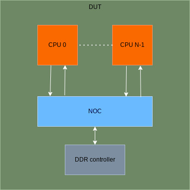
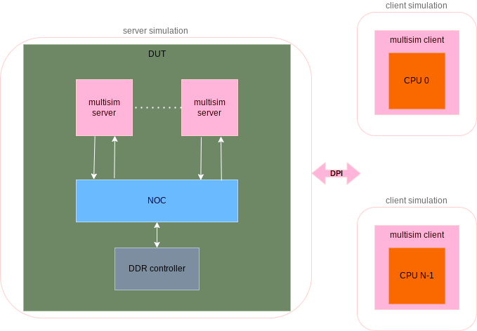
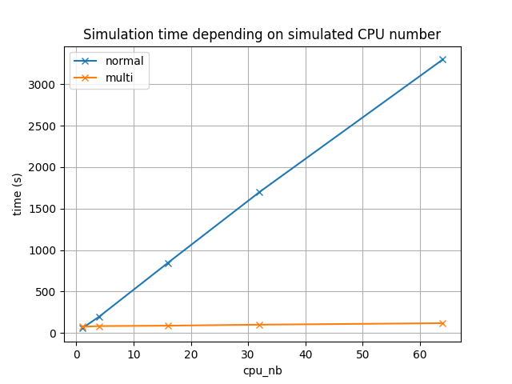

# 💡 rationale
RTL simulations are typically single threaded and don't scale very well when your DUT size increases.

`multisim` is a systemverilog/DPI library allowing multiple simulations to run in parallel and communicate to simulate your DUT.  
Typically, you can have:
* 1 **server simulation** with your DUT skeleton (NOC, etc)
* N **client simulations** with 1 big instance each (computing core, etc)

## example: normal vs multisim simulation
Assuming your original simulation has N CPUs that take a lot of simulation time.

You could transform this DUT:  


Into this one, running on N+1 simulation instances:  


If the CPU is the bottleneck in terms of performance, you could speed up your simulation N times.

# 🚄 performance
Reusing [this example](./example/multi/src) where we have:
* 1 **server simulation** with 1 NOC
* `CPU number` **client simulations** with 1 `cpu` (slow module) each



# ⚙ usage
## testbench
### example
See the following files from the [example](./example/multi/src):
* [server testbench](./example/normal/src/top.sv)
* [server replacement of CPU module](./example/multi/src/cpu_multisim_server.sv)
* [client simulation of CPU module](./example/multi/src/cpu_multisim_client.sv)

### channels
* **server simulation** and **client simulations** communicate through channels
* channels use a `rdy/vld` protocol to exchange `DATA_WIDTH` bits
* channels direction can be:
  * `client->server`: `multisim_client_push()` + `multisim_server_pull()`
  * `server->client`: `multisim_client_pull()` + `multisim_server_push()`
* those modules need a unique `server_name` to link a client/server channel together
* client modules need to set `SERVER_RUNTIME_DIRECTORY` to know the port/ip address of each channel
* each **client simulation** can use mulitple channels to communicate with the **server simulation**

### end of simulation
* **server simulation** can stop the simulation normally (`$finish`, etc)
* **client simulations** must not stop the simulation themselves
  * they will automatically be stopped when the **server simulation** is done

### modules
```verilog
// client->server
module multisim_client_push #(
    parameter string SERVER_RUNTIME_DIRECTORY = "../output_top",
    parameter int DATA_WIDTH = 64
) (
    input bit clk,
    input string server_name,
    output bit data_rdy,
    input bit data_vld,
    input bit [DATA_WIDTH-1:0] data
);
module multisim_server_pull #(
    parameter int DATA_WIDTH = 64
) (
    input bit clk,
    input string server_name,
    input bit data_rdy,
    output bit data_vld,
    output bit [DATA_WIDTH-1:0] data
);

// server->client
module multisim_server_push #(
    parameter int DATA_WIDTH = 64
) (
    input bit clk,
    input string server_name,
    output bit data_rdy,
    input bit data_vld,
    input bit [DATA_WIDTH-1:0] data
);
module multisim_client_pull #(
    parameter string SERVER_RUNTIME_DIRECTORY = "../output_top",
    parameter int DATA_WIDTH = 64
) (
    input bit clk,
    input string server_name,
    input bit data_rdy,
    output bit data_vld,
    output bit [DATA_WIDTH-1:0] data
);
````

## compilation
1. source [env.sh](./env.sh)
2. pass the right files to your simulator:
* server simulation, see [example](./example/multi/run_cpu)
* client simulation, see [example](./example/multi/run_top)

## runtime
See the [example](./example/multi/run_cpu):
* **simulation** (server+clients) [run script](./example/multi/run)
* **server simulation** [run script](./example/multi/run_top)
* **client simulation** [run script](./example/multi/run_cpu)

# ⚖ pros and cons
Pros:
* scalability: as long as you have enough CPUs on your server
* speed: split your big DUT in as many smaller parts as you want
* cost: server CPUs are cheaper than emulation solution usually
* bringup time: super easy modules, simple interface (e.g.: AXI is 5 channels)
* interoperability: each server/client can use different simulators (Verilator, VCS, Questa, Xcelium, etc)

Cons:
* ⚠ **no cycle accuracy** ⚠: functionally accurate, but not cycle accurate
* harder debug: waveforms split on N+1 simulation, no time coherency in between them

# 🚀 future
* simple transaction logging to help debug
